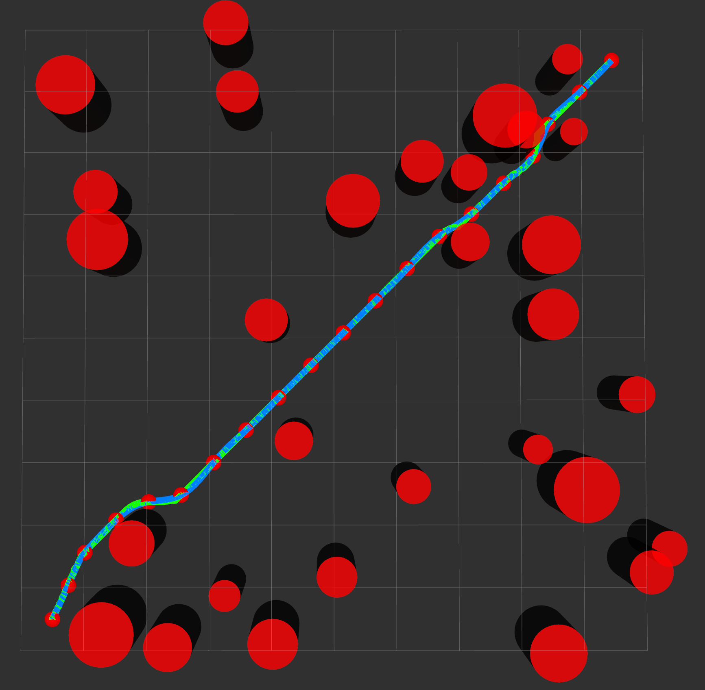
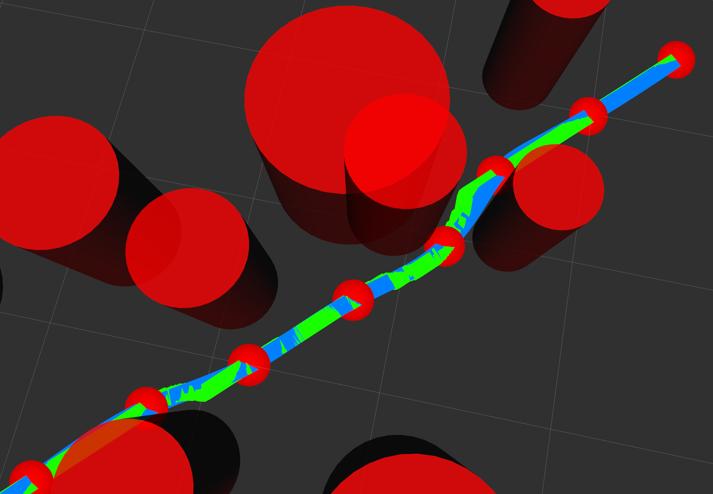
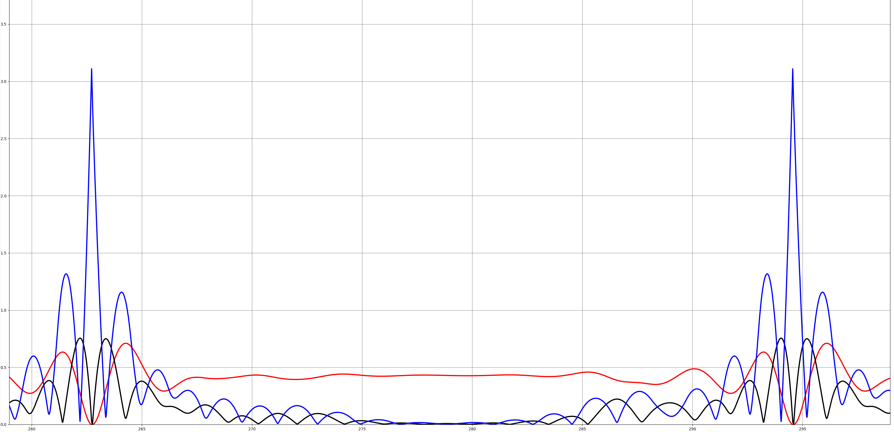
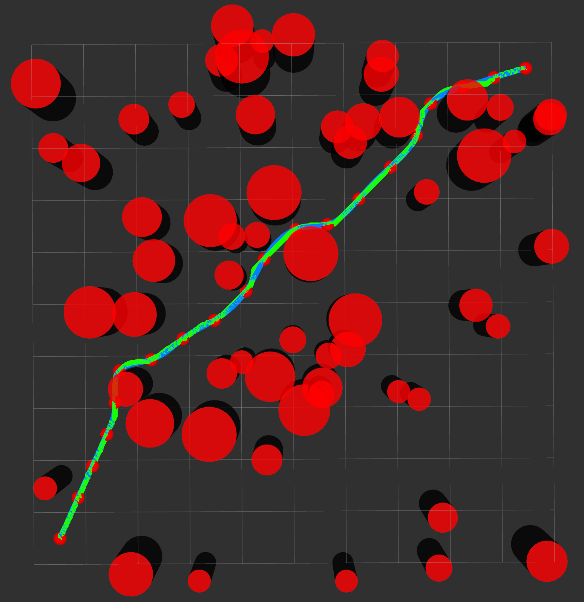
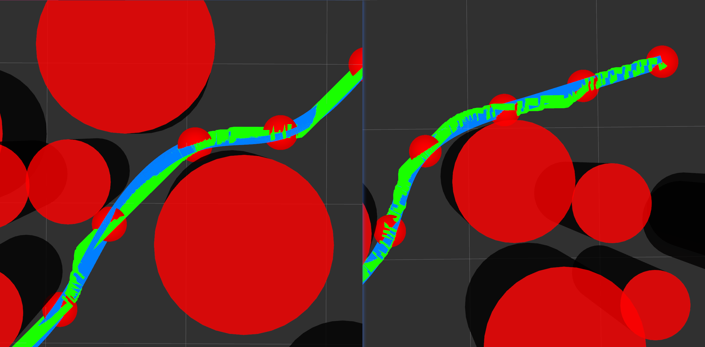
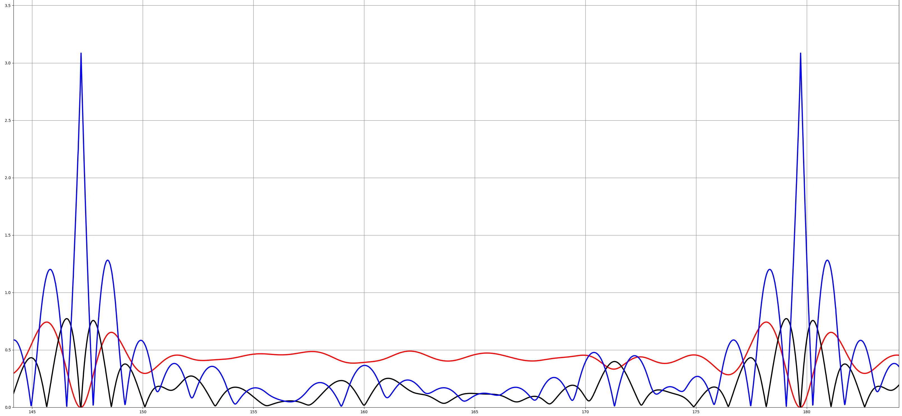

## Brief Introduction
Global plan under Astar algorithm and piecewise trajectory optimization through quintic polynomials, with the optimization goal of minimizing the jerk (rate of the acceleration change) of the trajectory and the constraint of continuous pos, vel, and acc. 

## How to Set up

Clone this repository code into your ROS workspace.

__Build__

```bash
cd ${dir_to_project}
catkin build 
```

__Launch the Astar global planner__

```bash
source devel/setup.sh
roslaunch astar_path_planner astar_planner.launch
```

__Launch the Trajectory Optimizater__

on another ternimal:

```bash
source devel/setup.sh
roslaunch astar_path_planner global_trajopt.launch
```
besides, you can set the value of _positionNum_ in _global_trajopt.cpp_ to adjust the piece number.

__Draw Velocity-time, Acceleration-time, and Jerk-time Plot__

on another ternimal:

```bash
rqt_plot
```
Choose topic _/vel_time_plot_, _/acc_time_plot_, and _/jer_time_plot_. If this common is not found, means the rqt_plot tool is not installed yet:

```bash
sudo apt-get update
sudo apt-get install ros-<your ROS version>-rqt-plot
```

## Results
__Case1: 30 obstacles__  
Trajopt algorithm average time cost: 23.441ms (10*10m map).

green: Astar global path;
blue: optimized global trajectory.

green: Astar global path;
blue: optimized global trajectory.

x-label: real time(s); 
y-label: magnitute of vel(red), acc(black), and jerk(blue).

__Case2: 60 obstacles__  
Trajopt algorithm average time cost: 23.186ms (10*10m map).

green: Astar global path;
blue: optimized global trajectory.

green: Astar global path;
blue: optimized global trajectory.

x-label: real time(s); 
y-label: magnitute of vel(red), acc(black), and jerk(blue).


## Reference
https://github.com/ZJU-FAST-Lab/GCOPTER


## Original course requirements

课程要求：

当编译无报错、rviz显示随机生成圆柱障碍物和绿色直线初始路径时表明编译安装成功

## 任务一

在src文件夹下的astar_planner中替换Step1～3的内容，实现随机生成的地图上的A*路径规划。

## 任务二
在Trajectory中替换Step 4部分，实现轨迹生成类，具体方案可见代码注释

## 提交要求：
1. 按照PPT要求完成实验报告
2. 代码提交方式为github链接，**请在实验报告中醒目位置给出代码仓库**
3. **请确保提交仓库中的代码可以直接运行**，如果使用第三方库请在README中说明
4. 报告中**必须包含**的结果截图
   1. A*算法的无碰撞路径图
   2. 所采用轨迹优化方法生成的轨迹图
5. 报告内容可以包含的内容（不必须）：不同障碍物环境下的效果，所采用方法的计算时间，不同求解方法的性能差异等
6. 研究现状可以从路径搜索、障碍环境表示、避障方法、轨迹规划、工程应用、轨迹跟踪控制器等多个维度展开，可以挑选自身熟悉的领域进行展开
